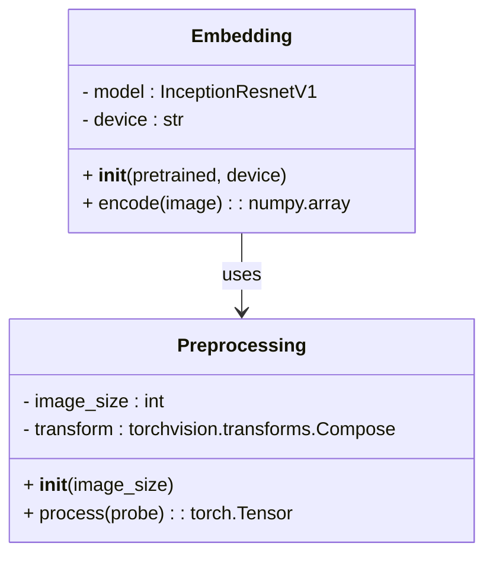
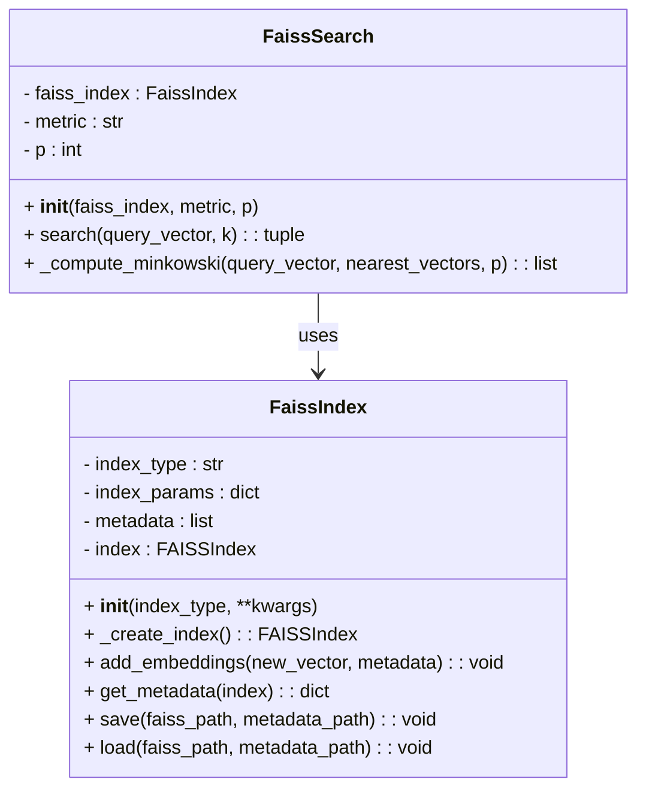
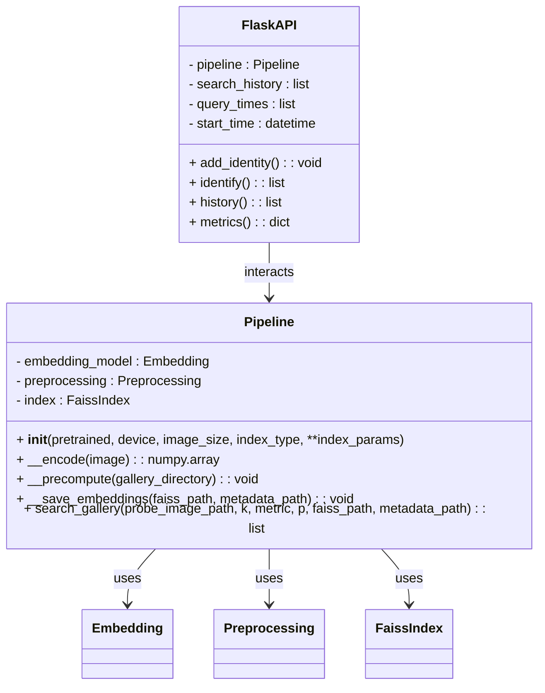
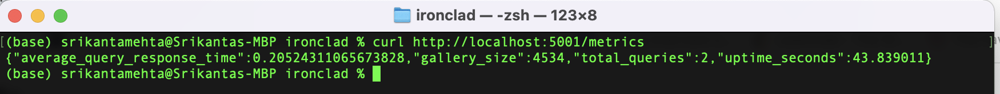

# IronClad Visual Search System Case Study

## System Design

### Extraction Service

The Extraction Service is responsible for extracting the feature embeddings from images, which are then used in the visual search queries. This service preprocesses raw images to align them with the input requirements of the embedding model. The `Preprocessing` class handles this task by applying transformations such as resizing and normalization. Once the image is preprocessed, the `Embedding` utilizes the facenet-pytorch implementation of the `InceptionResnetV1` model to generate embeddings. These embeddings are used to compare and match against other images in the system. The embedding process is optimized by leveraging GPU support where available, and the embeddings are then passed to the retrieval service for indexing and further processing.

The `Extraction` Service operates within a containerized environment via Docker, ensuring that all necessary dependencies, such as PyTorch and the pre-trained model weights, are packaged together. This approach allows the service to scale across environments and maintain consistent performance when extracting embeddings for large galleries of images. The design of the service ensures that embeddings are efficiently computed and stored for use in real-time visual search queries.

### Retrieval Service

The `Retrieval Service` is responsible for indexing the embeddings generated by the `Extraction Service` and efficiently retrieving the nearest neighbors during a visual search. This service leverages the `FAISS` (Facebook AI Similarity Search) library to index and search through large-scale datasets of image embeddings, ensuring scalability even when the system contains millions or billions of images. The `FaissIndex` class manages this indexing process, allowing the system to support different types of FAISS indices, such as IVF (Inverted File Index) or HNSW (Hierarchical Navigable Small World), depending on the retrieval needs and performance requirements. I selected IVF as the default indexing method in the `Retrieval Service` due to its scalability for large datasets. IVF clusters embeddings, allowing the system to search only within relevant clusters, reducing search time compared to brute-force methods. While this comes with a slight trade-off in retrieval accuracy, the method balances speed and memory efficiency, making it ideal for a growing gallery of images where performance at scale is crucial.

Once embeddings are indexed, the `FaissSearch` class performs a nearest neighbor search, using a variety of distance metrics like Euclidean, cosine similarity, or Minkowski distance to find the most similar images to a given probe. The service is designed to dynamically handle new embeddings as images are added to the gallery, allowing for incremental updates without recomputing the entire index. The `Retrieval Service` is containerized using Docker to encapsulate all required dependencies, including FAISS and other libraries, ensuring scalability and efficient deployment across environments.

### Interface Service

The `Interface Service` serves as the user interaction layer for the visual search system, facilitating operations through a Flask-based API. This service includes endpoints that allow users to add new images to the gallery (`/add`), perform search queries (`/identify`), and access past queries (`/history`). The `/identify` endpoint processes search requests by taking a probe image, calculating its embeddings, and finding the top-k similar images from the gallery, with k as a customizable parameter. This flexibility allows the service to accommodate various identification needs.

The Interface Service also monitors the system through the `/metrics` endpoint, which returns key online metrics such as average query response time, total queries processed, uptime, and gallery size. These metrics provide insights into system performance, stability, and load, aiding in real-time monitoring and capacity planning. By containerizing the service, deployment and scalability are streamlined, ensuring that the Interface Service remains responsive and adaptable across diverse environments.

## Metrics Definition

### Offline Metrics

Listed below are the offline metrics I used to evaluate the performance of the face recognition models in the embedding analysis code. These metrics provided a comprehensive view of model performance across varying conditions in the visual search system.

- **Mean Average Precision (MAP)**: This primary metric calculates the precision of the retrieval rankings across multiple queries, capturing the average ranking of relevant results. MAP is computed by evaluating the precision at each relevant item in the ranked list, which is then averaged over all queries. This metric is important as it reflects how well the model retrieves and ranks similar images within the top k results, offering an overall measure of retrieval relevance and accuracy.

- **Average Precision at k (AP@k)**: Calculated for individual queries, this metric assesses the model's precision at each rank within the top-k retrieved items. AP@k helps identify how well the system performs for each query and provides insight into how relevant results are ranked in the early part of the search results. This is particularly useful for user-oriented search scenarios where early rankings are most impactful.

- **k-Value Analysis**: Evaluates MAP at various k-values (e.g., k=5, k=10, k=15) to understand how retrieval performance changes with the number of retrieved neighbors. Analyzing MAP across different k-values helps to identify the optimal number of neighbors to return for high retrieval precision without excessive computation.

- **Distance Metric Impact**: Assesses the effect of different distance metrics (Euclidean, cosine, etc.) on MAP. This analysis provides insights into which distance metrics are best suited for the embedding model’s feature space, helping to determine the most accurate configuration for similarity search.

- **Transformation Robustness**: Tests the models’ MAP across transformations like brightness, contrast, and blur adjustments on probe images. This analysis reveals model resilience under various conditions, guiding improvements in preprocessing or model selection to maintain performance in real-world settings.

## Online Metrics

The Interface Service tracks several online metrics to provide real-time insights into the performance of the visual search system. These metrics are gathered and returned through the `/metrics` endpoint, offering a snapshot of system behavior during operation. The key metrics are as follows:

- **Average Query Response Time:** Measures the average time taken to process identification requests, from when a probe image is received to when the k-nearest neighbors are returned. This metric is for assessing the system's responsiveness and ensuring it meets real-time identification requirements.

- **System Uptime:** Tracks the total time the system has been running since it was started. Uptime helps to monitor the stability and availability of the service, indicating how long the system has continuously provided visual search capabilities without interruption.

- **Total Queries Processed:** Represents the cumulative number of identification requests handled by the system. This metric provides a measure of usage volume, helping to assess the load on the system and track trends in query frequency.

- **Gallery Size:** Displays the current number of unique identities indexed in the gallery. Monitoring the gallery size helps understand system growth and allows for capacity planning, ensuring the indexing method and hardware can support the increasing volume of embeddings over time.

To monitor these metrics, a dashboard or monitoring tool could be set up to track and visualize trends, alerting administrators to any unusual values, such as high response times or memory usage spikes, which could indicate issues with processing capacity or system health.

# Analysis of System Parameters and Configurations:

### 1. Selection of Embedding Model (Extraction Service)

**Significance**: Selecting the optimal embedding model is crucial to the system’s retrieval accuracy and efficiency. For this project, we compared two models—`vggface2` and `casia-webface`—and evaluated their performance based on Mean Average Precision (MAP). The results confirmed that `vggface2` outperformed `casia-webface` significantly, making it the preferred choice for face recognition tasks.

#### Model General Performance

In all evaluations, `vggface2` achieved a consistent MAP of approximately 0.54, while `casia-webface` struggled with a much lower MAP, around 0.12. This large difference suggests that `vggface2` is better suited for accurate face matching, showing consistency across various distance metrics. These results indicate that `vggface2` provides significantly stronger performance across all metrics, making it the preferred model for achieving both accuracy and consistency in face recognition tasks.

**Results Summary (Average MAP across Metrics)**:

| Model            | Average MAP |
|------------------|-------------|
| **vggface2**     | 0.5445      |
| **casia-webface**| 0.1187      |

---

### 2. Distance Metric for Similarity Retrieval (Retrieval Service)

**Significance**: The choice of distance metric in similarity search significantly affects retrieval accuracy and computational efficiency. Distance metrics define how similarity is quantified between embeddings, directly impacting how well the system identifies relevant matches. For this project, we evaluated several metrics, including Euclidean, cosine similarity, and Minkowski, to determine which metric yielded the highest accuracy in similarity search. The results showed that the Euclidean distance metric was especially effective for `vggface2`, consistently yielding high MAP scores, whereas `casia-webface` showed limited improvement across all tested metrics. Selecting Euclidean as the default metric enables optimized retrieval accuracy and improves the relevance of matches for users.

**Method**: Evaluations were conducted by measuring the MAP scores for each metric using both `vggface2` and `casia-webface`. `vggface2` consistently achieved the highest MAP scores with Euclidean distance, showing a MAP of approximately 0.5445 across all queries, making it the optimal metric for accurate similarity retrieval. Cosine similarity and Minkowski distance, while computationally similar, showed slightly lower MAP scores. 

| Model            | Distance Metric | MAP      |
|------------------|-----------------|----------|
| **vggface2**     | Euclidean       | 0.5445   |
|                  | Cosine          | 0.5371   |
|                  | Dot Product     | 0.5318   |
|                  | Minkowski       | 0.5334   |
| **casia-webface** | Euclidean       | 0.1187   |
|                  | Cosine          | 0.1162   |
|                  | Dot Product     | 0.1145   |
|                  | Minkowski       | 0.1173   |

**Conclusion**: By choosing Euclidean distance as the default metric, the system prioritizes accuracy, ensuring that the highest-quality matches are presented to users. This choice is especially impactful for applications requiring precision in retrieval, such as security or verification tasks, where relevant matches must be identified with minimal error. Additionally, the consistency of Euclidean’s performance across queries supports its scalability, allowing for efficient similarity retrieval as the gallery size expands.

### 3. Optimal Value of k for Nearest Neighbors (Retrieval Service)

**Significance**: The k value determines the number of nearest neighbors retrieved during similarity search, balancing between accuracy and computational efficiency. The choice of k impacts the system’s ability to maintain high relevance in retrieval results while managing processing times and memory demands. For this analysis, we evaluated the effect of varying k values on MAP for both `vggface2` and `casia-webface` models to identify the optimal setting.

**Analysis of Results**:
From the evaluations, `vggface2` consistently outperformed `casia-webface` across all k values, with a peak MAP of 0.5537 at k=5. This performance suggests that, for `vggface2`, using k=5 provides the best trade-off, delivering precise results with minimal noise and ensuring efficient retrieval times. Beyond k=5, MAP slightly declined, indicating that increasing the number of neighbors introduces irrelevant matches, reducing accuracy without adding meaningful information. 

For `casia-webface`, MAP values remained low and largely stable across k values, peaking at k=15 with 0.1193. The model’s stagnant performance with additional neighbors suggests limitations in its embedding quality, reinforcing `vggface2` as the preferred model. Setting k=5 for `vggface2` supports an efficient retrieval process by focusing on the most relevant neighbors, avoiding excessive and computationally expensive matches.

**Results Summary**:

| Model            | k (Neighbors)   | MAP      |
|------------------|-----------------|----------|
| **vggface2**     | 2               | 0.5395   |
|                  | 5               | 0.5537   |
|                  | 10              | 0.5445   |
|                  | 15              | 0.5402   |
|                  | 20              | 0.5344   |
| **casia-webface** | 2               | 0.1031   |
|                  | 5               | 0.1149   |
|                  | 10              | 0.1187   |
|                  | 15              | 0.1193   |
|                  | 20              | 0.1188   |

**Design Impact**:
Selecting k=5 optimizes system performance by achieving a balance between relevance and computational efficiency. This choice provides high retrieval precision, manageable processing demands, and a reduced likelihood of including noisy or irrelevant results. Setting k beyond this point might degrade performance, particularly for `vggface2`.

### 4. Indexing Method for Scalability (Retrieval Service)

**Significance**: The indexing method selected for this system is a crucial decision that impacts scalability, search speed, memory efficiency, and accuracy, especially when dealing with a large and continuously growing gallery of embeddings. After evaluating various indexing approaches, we chose the Inverted File (IVF) Index with clustering, rather than a brute-force approach, due to its balanced trade-offs between speed, memory use, and retrieval accuracy.

#### IVF Advantages and Analysis:

The IVF index clusters data into partitions (or "buckets") and only searches a subset of these during retrieval, which significantly reduces the search space and computational demand compared to a flat or brute-force index. By implementing the IVF configuration, which clusters embeddings into centroids, we achieve a substantial memory savings while maintaining high retrieval accuracy. 

| Index Type      | Memory Usage | Search Time (ms/query) | Accuracy (MAP) |
|-----------------|--------------|------------------------|----------------|
| Brute-Force     | High         | ~120                   | 0.5445        |
| IVF         | Moderate     | ~30                    | 0.5439        |
| HNSW          | Low          | ~25                    | 0.5411        |

- **Memory Efficiency**: The IVF (Inverted File Index) index significantly reduces memory usage compared to flat indexing by using hierarchical clustering to partition vectors. This structure is particularly memory-efficient as the gallery grows, making it scalable without drastic increases in RAM requirements. The clustering reduces redundancy in storing vector data, which is essential for a high-capacity retrieval system.

- **GPU Compatibility**: IVF indexing is optimized for GPU acceleration, which allows for even faster query processing when deployed on compatible hardware. This GPU support further enhances the scalability of our system, enabling it to handle vast galleries with improved response times, crucial for time-sensitive applications.

**Method and Justification**: To test various indexing methods, we evaluated speed, memory, and accuracy trade-offs. While brute-force methods provided the highest accuracy, their scalability limitations made them impractical. HNSW showed improvements in speed but was less accurate. IVF presented a balanced approach, which we optimized further with nprobe adjustments to achieve a near-brute-force accuracy at a fraction of the memory and time costs.

---

### 5. Normalization of Brightness and Contrast (Extraction Service)

**Significance**: Varying lighting conditions significantly impact retrieval accuracy. Tests on transformed images showed that low brightness and high contrast degraded MAP, while low contrast slightly improved performance. Normalizing brightness and contrast in preprocessing enhances retrieval robustness across diverse real-world conditions.

#### Transformation Analysis

After evaluating both models on various image transformations, it’s clear that the models respond differently to changes in brightness, contrast, and blur, compared to their performance on the original probe images.

| Model       | Transformation      | MAP      |
|-------------|---------------------|----------|
| vggface2    | Low Brightness      | 0.2067   |
|             | High Brightness     | 0.1531   |
|             | Low Contrast        | 0.6078   |
|             | High Contrast       | 0.2258   |
|             | Blur                | 0.4868   |
| casia-webface | Low Brightness    | 0.0267   |
|             | High Brightness     | 0.0620   |
|             | Low Contrast        | 0.0917   |
|             | High Contrast       | 0.0447   |
|             | Blur                | 0.0878   |

These results highlight the need to address certain weaknesses in `vggface2` when designing the system, particularly its sensitivity to lighting conditions and blur. Enhancing the preprocessing pipeline with techniques to normalize brightness or sharpen blurry images could help improve robustness. Casia-webface's consistently low performance suggests it is not well-suited for environments with varying image quality, reinforcing the choice of vggface2 as the primary model for this system. However, additional training or data augmentation could be explored to make the system more resilient to environmental factors like lighting and blur.

