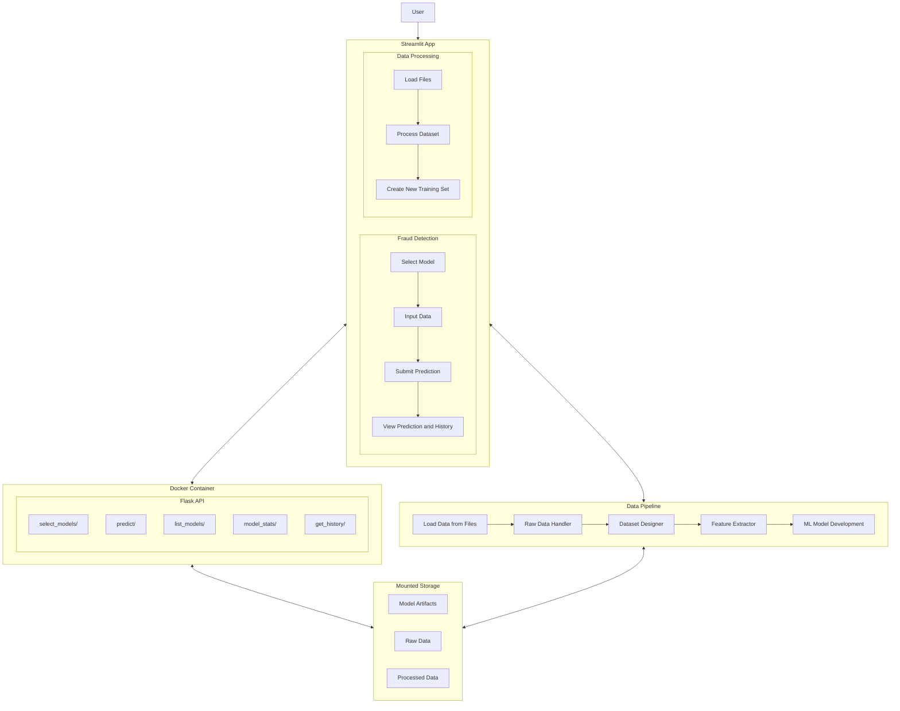

# SecureBank Fraud Detection System Report

## System Design

```mermaid
graph TD;
    
    User[User] --> Streamlit_App
    
    subgraph Streamlit_App[Streamlit App]
    
        subgraph Fraud Detection
            Select_model[Select Model] -->
            Input_Inference[Input Data] -->
            Submit_Prediction[Submit Prediction] -->
            View_Hist[View Prediction and History]
        end
        
        subgraph Data Processing
            Load_files[Load Files] -->
            Process_data[Process Dataset] --> 
            Training[Create New Training Set]
        end

    end

    Streamlit_App <--> Docker
    subgraph Storage[Mounted Storage]
        Model_Files[Model Artifacts]
        Raw[Raw Data] 
        Processed[Processed Data]
    end

    Streamlit_App <--> Data_Pipeline
    subgraph Data_Pipeline[Data Pipeline]
        B1[Load Data from Files] -->
        B2[Raw Data Handler] -->
        B3[Dataset Designer] -->
        B4[Feature Extractor] -->
        ML[ML Model Development] 
    end

    subgraph Docker[Docker Container]
        Select_model 
        Submit_Prediction 
        subgraph Flask[Flask API]
            Select[select_models/]
            Predict[predict/] 
            List[list_models/] 
            Stats[model_stats/]
            History[get_history/]
        end
    end

    Docker <--> Storage
    Data_Pipeline <--> Storage
```