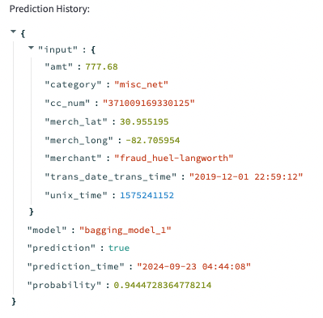

# SecureBank Fraud Detection System Report

## System Design

### High Level System Diagram

### How the System Design Meets the Requirements

The fraud detection system is designed to meet the core requirements of SecureBank's need for accurate and efficient fraud detection. The system is broken down into several modules and services that handle different parts of the workflow—from data ingestion and processing to model development, prediction, and evaluation.

- **R1: The system should improve from the previous performance of the model.**
  - The system incorporates multiple machine learning models (Random Forest, Bagging Classifier, Extra Trees) that are evaluated based on precision, recall, and F1 score using custom thresholds. The flexibility in model selection and evaluation ensures that the system achieves better precision and recall than the previous model, which had precision and recall scores of ~30% and ~60%, respectively. The custom threshold optimization process guarantees that the best-performing model is selected for fraud detection.

- **R2: The system should be able to predict if a given transaction is legitimate or fraudulent.**
  - The prediction functionality is made available through the Streamlit interface and a Flask API running in a Docker container. Users can input transaction details manually or upload a JSON file containing multiple transactions. The system processes the input data, applies feature engineering, and uses the selected machine learning model to predict whether each transaction is legitimate or fraudulent. The Flask API `/predict/` endpoint handles predictions, making it accessible for both single and batch transactions.

- **R3: The system should allow administrators to generate a new dataset for training from the available data sources.**
  - The system includes a data pipeline with modules for extracting, processing, and partitioning data. The **Raw Data Handler** extracts raw data from CSV, Parquet, and JSON files, while the **Dataset Designer** splits the data into training and test sets, ensuring no data leakage. Administrators can use the Streamlit interface to load raw files, process them, and generate new datasets from specific time ranges they are interseted in.

  

- **R4: The system should allow administrators to select from a catalog of pre-trained models.**
  - Administrators can use the Streamlit interface to select from a list of pre-trained models stored in the system’s model artifacts. This selection is facilitated by the `/list_models/` and `/select_model/` Flask API endpoints, which enable the selection of the model best suited for current fraud detection needs. The models are stored in a structured format, allowing for quick retrieval and deployment in predictions.

- **R5: The system should allow administrators to audit the system's performance.**
  - The system allows for performance auditing by providing metrics such as precision, recall, and F1 score for each model. These metrics are displayed in the Streamlit interface when an administrator selects the option to view model stats. The `/model_stats/` Flask API endpoint provides this information, ensuring that administrators can regularly check how well the system is performing and decide if retraining or model updates are necessary. The system also allows for viewing of historical prediction records through the `/get_history/` endpoint. This returns all predictions made as well as the model used for the prediction and the day and time the prediction was made. This allows for further analysis of system performance post prediction.

### Description of Unique Functionalities

#### 1. **Streamlit Application for Fraud Detection**

The Streamlit application acts as the user interface for fraud detection. It allows users to:
- Select a pre-trained model from the available list of models.
- Input transaction data for fraud prediction or upload a JSON file with multiple transactions.
- Submit predictions and receive immediate feedback on whether a transaction is legitimate or fraudulent.
- View prediction history and model performance metrics.

#### 2. **Data Processing Pipelines**

The system processes raw data from multiple sources, including customer details, transaction records, and fraud labels. The data is loaded into the system and passed through various steps such as cleaning, transformation, and feature extraction.

The **Raw Data Handler** is responsible for:
- Extracting raw data from CSV, Parquet, and JSON formats.
- Cleaning and transforming the data to create a structured dataset.

The **Dataset Designer** partitions the data into training and test sets, ensuring no data leakage and preserving temporal relationships in the data.

The **Feature Extractor** performs feature engineering by transforming time-based features (e.g., cyclical encoding for hours, days, and months), scaling numeric data, and encoding categorical features for model training.

#### 3. **Model Development and Evaluation**

The system supports the use of any suitable classification model. For this case study, three models were developed and evaluated: a Random Forest model, a Bagging Classifier with Decision Trees, and an Extra Trees Classifier. Each model is trained on the processed data and evaluated using custom thresholds to maximize the F1 score, while meeting precision and recall baselines.

Model training will be discussed in more detail below. In regards to system design, each model that was trained, along with its corresponding threshold, feature transformers, and evaluation metrics, is saved into a structured artifact directory. The model and its metadata are stored as follows:
     - `../storage/models/artifacts/random_forest_model_1/model.pkl`
     - `../storage/models/artifacts/bagging_model_1/model.pkl`
     - `../storage/models/artifacts/extratrees_model_1/model.pkl`
   - These saved models can later be selected by administrators or users via the Streamlit interface or Flask API for fraud detection in real-time.

In conclusion, the system efficiently develops and evaluates multiple machine learning models, ensuring that the best-performing model is deployed for fraud detection. 

#### 4. **Flask API for Model Inference and Management**

A Flask API running inside a Docker container provides endpoints for:
- Selecting a model for inference.
- Making predictions on transaction data.
- Viewing model statistics (e.g., precision, recall, F1 score).
- Accessing prediction history.

The Docker container ensures isolation and scalability, allowing the system to be deployed in various environments while interacting with the Streamlit interface.

## Data, Data Pipelines, and Model

### Description of the Data and Significant Patterns Influencing the Design

The dataset used for the fraud detection system includes customer information, transaction details, and fraud labels. These three data sources—customer, transaction, and fraud—are merged to form a final dataset that drives model training and prediction.

The analysis of this dataset in the `data_analysis.ipynb` reveals several significant patterns that directly influence the feature engineering and design of the fraud detection system:

#### 1. **Hour of Day Influences Fraudulent Activity**
Through statistical analysis, it was observed that the frequency of fraudulent transactions is significantly higher during night hours. A chi-squared test confirmed a statistically significant relationship between the hour of the day and the likelihood of fraud. This insight led to the inclusion of cyclical time features such as hour-of-day sine and cosine transformations in the model to capture this periodic trend.

#### 2. **Day of the Week Shows Minor Influence**
While there is a slight increase in fraudulent activity during mid-week, the differences between days are relatively small. A chi-squared test revealed that the day of the week does influence fraud occurrences, but this trend is less pronounced compared to the hour of the day. Nonetheless, the day of the week is included as a feature to provide additional context to the transaction.

#### 3. **Fraudulent Transactions Occur in Quick Succession**
Fraudulent transactions tend to happen in quick succession. An analysis of time intervals between consecutive transactions shows that fraudulent transactions have shorter time intervals compared to non-fraudulent ones. This observation makes sense as fraudsters may attempt multiple transactions in a short period before detection. Consequently, the time difference between transactions is included as a feature to identify patterns of rapid transaction attempts.

#### 4. **Fraud Occurrence by Transaction Category**
Certain transaction categories, such as grocery and shopping, exhibit a higher proportion of fraudulent activity. A chi-squared test confirmed that this relationship is statistically significant. As a result, the category of the transaction is one of the key categorical features used in model development.

#### 5. **Transaction Amount**
Fraudulent transactions typically have a higher average transaction amount compared to non-fraudulent ones. The distribution of transaction size for fraudulent transactions is wider, with a higher mean and standard deviation. This pattern is captured by the model, with the transaction amount included as a critical numeric feature.

These insights drive the selection of features and the overall system design, ensuring the model effectively captures the underlying patterns in fraudulent behavior.

### Explanation of Data Pipelines

The data pipeline consists of three core stages: extraction, transformation, and partitioning. Each stage is implemented using custom Python classes, ensuring that the data is cleaned, processed, and properly formatted before it is used in model training or inference.

#### 1. **Data Extraction**
Data is extracted from three different file types:
- **Customer data** (CSV format)
- **Transaction data** (Parquet format)
- **Fraud labels** (JSON format)

This extraction is handled by the `Raw_Data_Handler` class, which reads the files into Pandas DataFrames. Any missing or corrupted files are caught with error handling, ensuring that the process does not halt unexpectedly.

#### 2. **Data Transformation**
After the data is extracted, it is cleaned and merged. The `Raw_Data_Handler` class performs several key transformations:
- **Data Merging**: The transaction data is merged with fraud labels based on transaction numbers and then merged with customer data based on credit card numbers.
- **Date Parsing**: The `trans_date_trans_time` column is converted into a proper datetime format for further time-based feature engineering.
- **Missing Values**: Missing values in critical columns such as `unix_time`, `category`, and `merchant` are imputed based on logical assumptions or filled with default values.
- **Feature Formatting**: String columns are converted to lowercase, and irrelevant columns are dropped. The final dataset is sorted by the transaction time to ensure proper temporal sequence.

#### 3. **Data Partitioning**
Once the dataset is cleaned, it is partitioned into training and test sets. The `Dataset_Designer` class is responsible for this step. It:
- **Splits the data**: The dataset is split into training and test sets based on transaction time, ensuring that no data from the test set leaks into the training set.
- **Optional Date Filtering**: Administrators can filter the dataset by specific date ranges to limit the training or test data to certain time periods.
- **Class Distribution and Dataset Metrics**: After partitioning, the class distribution of fraud cases is analyzed to ensure that both sets are representative of the original data. 

#### 4. **Feature Engineering**
The `Feature_Extractor` class applies essential feature transformations. It:
- **Cyclical Time Features**: Converts time-based features like hour of the day, day of the week, and month into cyclical sine and cosine values, capturing periodic patterns in fraud activity.
- **Numeric Scaling and Categorical Encoding**: Uses standard scaling for numeric features like transaction amount, latitude, and longitude, and target encoding for categorical features like transaction category and merchant.
- **Feature Combination**: The transformed numeric and categorical features are then combined into a final set of features used for model training.

#### 5. **Saving Transformed Data**
The cleaned and transformed data can be saved as a Parquet file for future use. The `Raw_Data_Handler` class saves the processed data in a specified directory, and the `Dataset_Designer` class saves the training and test sets.

This pipeline ensures that the raw data is systematically cleaned, transformed, and prepared for machine learning model development, resulting in consistent and high-quality input for the system.

### Description of the Inputs and Outputs of the Model

#### **Model Inputs**
The inputs to the model consist of both numerical and categorical features that represent key characteristics of the transactions and the customers involved. The specific inputs include:

1. **Numerical Features:**
   - **amt**: The transaction amount.
   - **merch_lat**: Latitude of the merchant's location.
   - **merch_long**: Longitude of the merchant's location.
   - **hour_sin** & **hour_cos**: Cyclical encoding of the hour of the transaction, representing the time of day.
   - **day_sin** & **day_cos**: Cyclical encoding of the day of the week.
   - **month_sin** & **month_cos**: Cyclical encoding of the month in which the transaction occurred.

2. **Categorical Features:**
   - **category**: The category of the transaction (e.g., groceries, entertainment).
   - **merchant**: The merchant where the transaction occurred.

These inputs are passed through feature transformation pipelines that include scaling for numerical features and target encoding for categorical features. This process ensures that all input data is in a format suitable for model training and prediction.

#### **Model Outputs**
The model's output is a binary classification indicating whether a transaction is fraudulent (`1`) or legitimate (`0`). Specifically, the outputs include:

1. **Fraud Prediction**: 
   - **1**: The model predicts the transaction to be fraudulent.
   - **0**: The model predicts the transaction to be legitimate.

2. **Fraud Probability**: 
   - The model also produces a probability score for each transaction, which indicates the likelihood that a given transaction is fraudulent. This score is used alongside a custom decision threshold to determine the final binary classification.

The model's outputs are used to make real-time fraud predictions when new transaction data is provided via the Streamlit interface or Flask API.

## Metrics Definition

### Offline Metrics
Offline metrics are used during the training and evaluation of the models. These metrics are crucial for understanding how well a model is performing before it is deployed in a production environment. The following metrics are calculated based on predictions on a held-out test set:

1. **Precision**: Precision measures the proportion of positive identifications (fraudulent transactions) that were actually correct. A high precision score means that the model makes few false positive errors, which is important in a fraud detection system to avoid unnecessary disruptions for customers.
   
2. **Recall**: Recall measures the proportion of actual positive cases (fraudulent transactions) that were identified correctly. In a fraud detection scenario, missing fraudulent transactions (false negatives) can be costly, making recall a critical metric to ensure that the system catches as much fraud as possible.

3. **F1-Score**: The F1-score is the harmonic mean of precision and recall, providing a balance between the two. This is especially useful in imbalanced datasets, like fraud detection, where both precision and recall are important to optimize.

4. **Custom Threshold**: The model's decision threshold is optimized to balance precision and recall. By adjusting the threshold, the system ensures that the trade-off between precision and recall fits the specific requirements of the business, minimizing false positives while catching as much fraud as possible.

These metrics are calculated during the offline evaluation phase to guide the selection of the best-performing model. The results, including precision, recall, and F1-score, are stored as part of the model metadata for reference and auditing.

### Online Metrics
Online metrics are collected when the system is deployed and handling live data. These metrics track the performance of the model in a real-world environment and provide insights into how the model is behaving over time. The online metrics include:

1. **Fraud Prediction**: The system returns a binary prediction for each transaction:
   - `1`: Indicates that the transaction is predicted as fraudulent.
   - `0`: Indicates that the transaction is predicted as legitimate.

2. **Fraud Probability**: For each transaction, the system also provides a probability score that indicates the likelihood of fraud. This score can be used for further analysis or for fine-tuning the decision threshold in production.

3. **Prediction History**: The system stores a detailed history of each prediction, which includes:
   - **Input Data**: The transaction data used to make the prediction.
   - **Model Version**: The version of the model used to make the prediction.
   - **Prediction**: The binary fraud prediction (`0` or `1`).
   - **Probability**: The probability score associated with the fraud prediction.
   - **Prediction Time**: The timestamp of when the prediction was made.

   This history is valuable for auditing purposes, allowing administrators to trace back any decision the system made, as well as to monitor model drift or changes in performance over time.

4. **Model Statistics**: The system provides access to model performance statistics, including precision, recall, and F1-score from the training phase, through an API endpoint. This allows administrators to regularly review the model's performance and decide whether retraining or model updates are necessary.

These online metrics help ensure that the fraud detection system continues to perform optimally in real-world scenarios, and they provide transparency for auditing and performance tracking.

## Analysis of System Parameters and Configurations

### Feature Selection
 In this system, a combination of numerical, categorical, and time-based features is used to capture various aspects of transaction behavior as described in detail above. 

 During development several other features and feature engineering techniques were tried but eventually dropped since they did not improve performance on validation sets. These methods included:
 - Storing average transaction amount and average time between transactions for existing customers to compute the difference from this average for each subsequent transaction. This was difficult to implement to avoid data leakage during training and also because many transactions were by new customers.
 - Using feature decomposition techniques like PCA. This led to underfitting on the training and test set.
 - Using oversampling techniques like SMOTE. 
 - Using feature selection techniques like recursive feature elimination. This significantly increase model training time and did not significantly impact model performance since the total feature set was already fairly small.

### Dataset Design
The dataset is designed to ensure that the model generalizes well to unseen data while avoiding data leakage. The data pipeline begins by extracting raw data from CSV, Parquet, and JSON files for customer, transaction, and fraud data. 

1. **Raw Data Handling**: The `Raw_Data_Handler` module is responsible for reading and merging the customer, transaction, and fraud data. Missing values are handled with imputation strategies for fields like `category` and `unix_time`. The merged dataset is then sorted by transaction time to ensure chronological integrity.

2. **Train-Test Split**: The dataset is split into training and test sets using a time-based approach, where transactions in the training set occur before those in the test set. This helps simulate a real-world scenario where the model predicts future transactions based on past data. By default, 20% of the dataset is used for testing. The `Dataset_Designer` module manages this process, ensuring that data leakage is avoided and the temporal order of transactions is maintained.

3. **Data Partitioning**: Once the dataset is split, the system computes important statistics such as class distribution (fraud vs. non-fraud), dataset size, and feature count. This ensures that the system is aware of any imbalances in the dataset and can handle them accordingly during model training and evaluation.

### Model Evaluation and Selection

The system supports the training and evaluation of several machine learning models, including Random Forest, Bagging Classifier, Extra Trees, and a Multilayer Perceptron (MLP). Each model is evaluated based on its performance on precision, recall, and F1 score using custom thresholds.

1. **Model Training**: The training process for each model begins with hyperparameter tuning, which is initially performed using time-sensitive cross-validation. This ensures that the models are trained in a manner that respects the temporal nature of the data, simulating how the model would perform on future unseen data. The cross-validation process is used to fine-tune hyperparameters such as the number of estimators in Random Forest, the depth of decision trees in Bagging Classifier, and the hidden layer sizes in MLP. Once tuned, the models are trained on the entire training dataset. After training, the `evaluate_model_with_custom_threshold` function is applied.
2. **Threshold Optimization**: The `evaluate_model_with_custom_threshold` function calculates precision, recall, and F1 scores across different decision thresholds. This function identifies the threshold that optimizes the F1 score while ensuring that minimum precision and recall requirements are met (e.g., precision ≥ 35% and recall ≥ 65%). This threshold optimization process helps to balance the trade-off between false positives and false negatives, which is particularly important in fraud detection where the cost of incorrect classifications can be significant.

3. **Model Selection**: Once all models have been trained and thresholds optimized, the system evaluates each model based on the combination of precision, recall, and F1 score. Models such as Random Forest, Bagging Classifier, and Extra Trees are then compared to determine which one offers the best balance of these metrics. The system selects the model with the highest F1 score and best satisfies the constraints of precision and recall for deployment.

| Model                     | Best Threshold | F1-Score (%) | Precision (%) | Recall (%) |
|----------------------------|----------------|--------------|---------------|------------|
| **Random Forest**           | 0.27           | 66.16        | 62.50         | 70.28      |
| **Bagging Classifier**      | 0.39           | 72.39        | 75.38         | 69.64      |
| **Extra Trees Classifier**  | 0.16           | 52.13        | 43.17         | 65.77      |

The Bagging Classifier model achieves the highest F1 score of 72.39%, with a well-balanced precision of 75.38% and recall of 69.64%. As such, it was selected as the best-performing model for deployment in this case.

4. **Model Saving**: After evaluation, the selected model is saved alongside its associated metadata, including the decision threshold, numeric transformer, target encoder, and key evaluation metrics. These components are essential for inference and system audits and are stored in the system's model artifacts directory. This structured format allows for easy retrieval and deployment of the model during inference, ensuring consistency and reproducibility of predictions.

### Post-deployment Policies

Once the fraud detection system is deployed, it is import to make sure that the model performs optimally in real-world settings, especially as fraud patterns may evolve over time. To address this, a detailed post-deployment monitoring and maintenance plan is necessary, along with fault mitigation strategies to minimize the impact of any issues that may arise during operation.

#### Monitoring and Maintenance Plan

1. **Performance Monitoring**:
   - **Continuous Monitoring of Predictions**: The system logs each prediction made by the model, including the input data, the model version used, the probability score, the final prediction, and the timestamp of the prediction. This enables detailed auditing of the model’s performance and ensures traceability of individual decisions.
   - **Model Metrics Tracking**: Key metrics such as precision, recall, F1 score, and decision threshold should be tracked over time. By comparing these metrics with the results observed during the model’s training and validation phase, we can detect any performance degradation early on.
   - **Alerting System**: If the model’s precision or recall falls below pre-defined thresholds (e.g., precision below 35% or recall below 60%), automated alerts will notify administrators. This ensures that any significant drop in performance is flagged promptly, allowing for immediate investigation and remediation.

2. **Scheduled Retraining**:
   - **Model Retraining Frequency**: The model should be retrained on a regular basis to adapt to any changes in fraud patterns. A scheduled retraining process could occur monthly or quarterly, depending on the rate of change in transaction behavior and fraud types observed in the data.
   - **Use of Updated Data**: Retraining should incorporate the latest transaction and fraud data. Any new fraud cases that were missed by the current model can be included in the updated training set to improve future detection accuracy.
   - **Threshold Reevaluation**: Along with model retraining, the decision threshold should be reevaluated to ensure it continues to meet the precision and recall targets. The `evaluate_model_with_custom_threshold` function should be used during retraining to find the optimal threshold for the updated model.

3. **Model Versioning and Rollbacks**:
   - **Version Control**: Each model deployed will have a version number associated with it. This allows for accurate tracking of which model is in use at any given time and facilitates auditing and comparison across different versions.
   - **Rollback Mechanism**: If a newly deployed model underperforms or introduces unexpected faults, the system will have the ability to roll back to a previous version. The ability to quickly switch between models ensures that the system can continue to operate with minimal downtime during troubleshooting.

#### Fault Mitigation Strategies

1. **Handling Prediction Failures**:
   - **Fallback Mechanism**: In the event of a prediction failure (e.g., a corrupted input file or an issue with the inference pipeline), the system will return a default prediction of “legitimate” to ensure that operations can continue smoothly. These cases will be logged for further investigation.
   - **Batch Processing Fault Tolerance**: During batch processing of transactions, if one or more transactions fail due to data corruption or processing errors, the system will skip the faulty records and continue processing the rest of the batch. The skipped transactions will be flagged for review and correction.
   
2. **Data Integrity Checks**:
   - **Input Data Validation**: Before making predictions, the system will validate input data to ensure that required fields are present and formatted correctly. This prevents errors caused by missing or malformed data.
   - **Outlier Detection**: Data points that deviate significantly from normal patterns (e.g., unusually large transactions or transactions with anomalous time intervals) will be flagged as potential data issues or as higher-risk transactions. This can help prevent incorrect predictions due to faulty or misleading data.

3. **Infrastructure Monitoring**:
   - **API Health Monitoring**: The Flask API handling predictions and model selection will be monitored for uptime and performance metrics (e.g., response time and error rates). Automated alerts will notify the team of any API downtime or performance bottlenecks.
   - **Resource Utilization Tracking**: System resources (CPU, memory, disk usage) will be monitored to ensure that the Docker container hosting the API and other infrastructure components is operating within acceptable limits. Overload conditions or resource leaks will trigger automated scaling or rebooting, ensuring continuous system availability.

4. **Incident Response and Troubleshooting**:
   - **Error Logging and Root Cause Analysis**: All errors, whether related to prediction, data processing, or system failures, will be logged with detailed information to facilitate quick root cause analysis. This will help in diagnosing and fixing issues effectively, ensuring minimal disruption to the system’s operation.
   - **User Notifications**: In cases where faults impact the prediction accuracy or availability of the system

