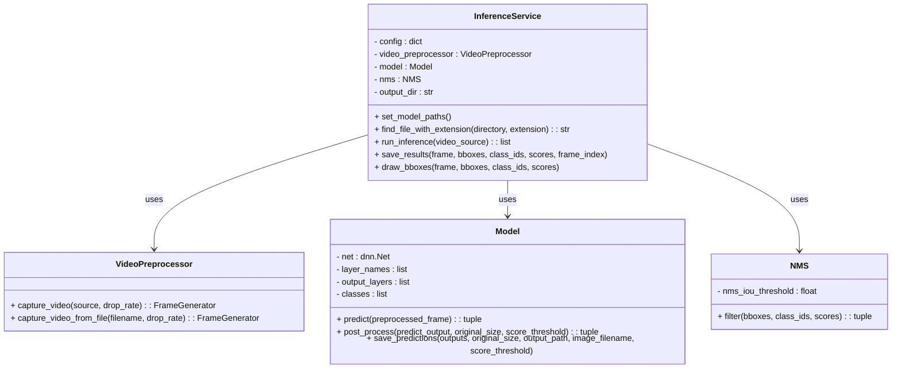
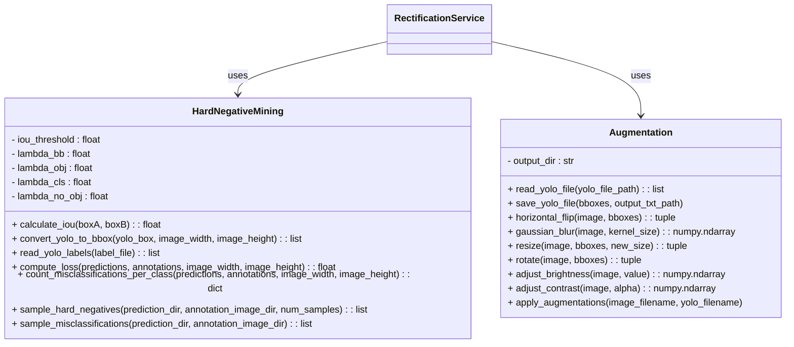
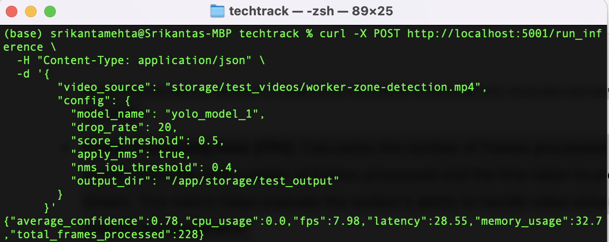
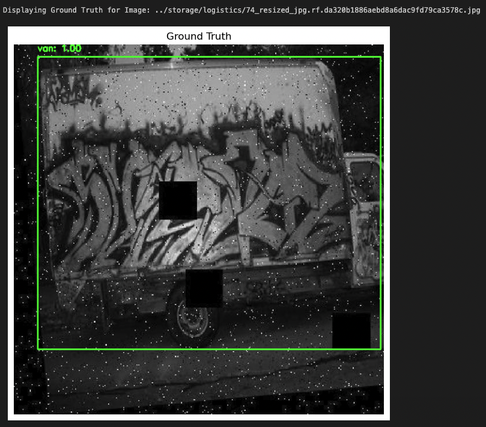
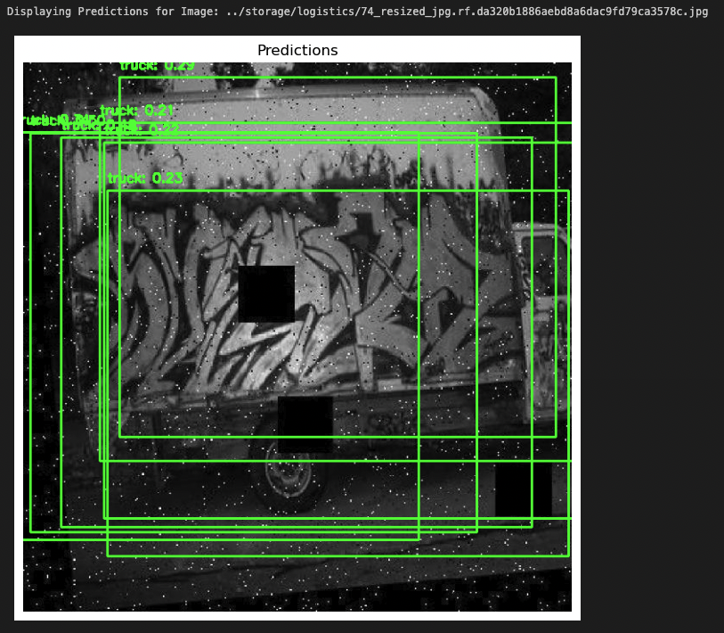

# TeckTrack Case Study

## System Design

The system is divided into several services, each performing distinct tasks to achieve an effective object detection pipeline for videos and UDP streams. Below is an overview of each service:

### Inference Service

---

---
 

The Inference Service is the core component responsible for running object detection on video frames. It takes preprocesses frames from a video or UDP stream and uses the selected YOLO model to predict bounding boxes, class IDs, and confidence scores for detected objects. This service also includes post-processing functionality, which filters raw predictions using a tunable confidence threshold value. Post-processed predictions are passed through a final Non-Maximum Suppression (NMS) algorithm to filter overlapping detections, ensuring that only the most relevant bounding boxes are retained. The results are saved as both annotated images and YOLO-format text files, which can be used for further analysis or visualization. 

The Inference Service is containerized using Docker, making it easy to deploy and manage across different environments. The container includes all necessary dependencies, such as OpenCV and YOLO model files, to run the inference process smoothly. The service is exposed via a Flask API, which allows users to interact with the system by sending HTTP POST requests. The `/run_inference` endpoint takes a JSON payload containing the video source (either a file path or UDP stream URL) and configuration parameters, such as model name, drop rate, and NMS settings. Once the inference is complete, the results are returned as a JSON response and saved locally in the container. This setup ensures that the Inference Service is accessible, scalable, and can be integrated into larger workflows or systems.

### Rectification Service

---

---
 

The Rectification Service focuses on improving the quality of the model by identifying and augmenting hard negatives from the dataset. Hard negatives are images where the model has difficulty making accurate predictions, often leading to false positives. The service uses a Hard Negative Mining module to evaluate predictions against ground truth annotations, calculating various loss components such as bounding box loss, classification loss, and objectness loss. The hardest images are determined based on a combination of these loss metrics, with higher loss values indicating more challenging examples for the model. Additionally, the Rectification Service also identifies the classes with the most misclassifications, helping to focus on areas where the model struggles the most. By identifying the top-N hardest negative examples and the classes with the highest misclassification rates, the service provides a means to refine the dataset and improve model performance in subsequent training iterations. 

In addition to identifying hard negatives, the Rectification Service also performs augmentations on the selected images to increase dataset diversity and robustness. Augmentations include transformations such as horizontal flipping, Gaussian blur, resizing, rotation, brightness adjustment, and contrast adjustment. These augmentations are applied systematically, and the resulting images, along with their updated YOLO annotations, are saved for future use. This service is not containerized, allowing for more flexibility in accessing and processing large datasets, and it plays a critical role in enhancing the overall accuracy and resilience of the object detection system.

### Interface Service

The Interface Service is responsible for facilitating video stream processing using the UDP protocol and integrating this stream with the Inference Service for real-time object detection. It provides an entry point for streaming video data to the system, ensuring compatibility with different input sources, such as surveillance cameras or live feeds. This service captures video frames from a UDP stream and passes them to the Inference Service for processing.

The Interface Service also provides a means for users to interact with the Inference Service via a Flask API that is hosted within a Docker container. This containerized setup ensures that the Interface Service can be easily deployed and scaled according to the needs of the application. The Interface Service enables seamless communication between the video stream and the Inference Service, making the object detection system versatile for various real-time applications, such as monitoring and surveillance tasks. By using Docker, the deployment process is simplified, and the service can run consistently across different environments, making the system highly adaptable for a range of use cases.

## Metrics Definition

### Offline Metrics

Listed below are the offline metrics I used to evaluate the performance of the object detection models in the `model_performance.ipynb` notebook. These provided insights into both models accuracy and reliability in detecting and classifying objects. 

- **Intersection over Union (IoU)**: Measures the overlap between predicted and ground truth bounding boxes. IoU is calculated by comparing the area of overlap to the area of union between the predicted and ground truth boxes. It provides a quantifiable metric for evaluating how accurately the model localizes objects. This is computed using a utility function that takes bounding boxes in (x_min, y_min, width, height) format.

- **Precision and Recall**: Calculated at different IoU thresholds to evaluate detection reliability and coverage. Precision represents the proportion of correct detections among all detections, while recall measures the proportion of correct detections among all ground truth objects. These metrics are gathered by comparing predicted bounding boxes with ground truth labels for each test image and computing true positives, false positives, and false negatives.

- **Average Precision (AP)**: Derived from the precision-recall curve, AP represents the model's performance for each class. Precision and recall are calculated at various confidence score thresholds, and the area under the precision-recall curve is averaged to obtain AP for each class.

- **Mean Average Precision (mAP)**: Calculated by averaging AP across all classes. mAP provides an overall measure of the model's object detection performance, ensuring that the performance of each class is considered equally. This is crucial for understanding the model's effectiveness across different object categories.

- **Model Inference Speed**: Measures the average time taken for the model to process an image and produce detections. This metric is collected using the `timeit` library, which runs inference on multiple images and computes the average, minimum, and maximum inference times. Model inference speed is a critical metric to ensure the system meets real-time processing requirements.

### Online Metrics

The inference service captures several key performance metrics after processing a video stream. These metrics are calculated and returned as a JSON object, providing valuable insights into the system's behavior during runtime. The following metrics are included:

- **Latency:** Measures the total time taken to process the entire video stream, starting from when the inference service begins processing to when it completes. This metric is crucial for understanding the system's response time and ensuring real-time performance requirements are met.

- **Frame Processing Rate (FPS):** Calculates the number of frames processed per second. It is derived from the total number of frames processed and the time taken to process the entire stream. This metric helps evaluate the system's ability to handle video streams at different speeds and resolutions.

- **Average Detection Confidence:** Provides the average confidence score of the detections made during the inference process. It is calculated from the detection confidence scores of individual frames, offering a measure of the model’s certainty in its predictions.

- **CPU Usage:** Reflects the percentage of CPU resources used by the system during the inference process. It helps assess the computational load on the system and the potential impact on other running processes.

- **Memory Usage:** Indicates the percentage of system memory utilized during inference. This metric is useful for understanding the memory demands of the inference service and ensuring the system can handle the workload without running into memory constraints.

- **Total Frames Processed:** Represents the total number of frames that were analyzed during the inference process. This metric is valuable for verifying the completeness of the video stream processing and ensuring no frames were skipped or lost.

## Analysis of System Parameters and Configurations:

### 1. Impact of Confidence Threshold on Model Precision and Recall

One of the key design decisions in the Inference Service is selecting the confidence threshold used for filtering out low-confidence detections. This threshold directly impacts the balance between precision and recall, influencing how the system prioritizes correct detections versus coverage of detected objects. To evaluate this, I analyzed the average precision and recall for two models (Model 1 and Model 2) at varying confidence threshold levels (0.2, 0.4, 0.6, and 0.8).

| Score Threshold | Model 1 Average Precision | Model 1 Average Recall | Model 2 Average Precision | Model 2 Average Recall |
|-----------------|---------------------------|------------------------|---------------------------|------------------------|
| 0.2             | 0.7033                    | 0.6930                 | 0.7134                    | 0.7281                 |
| 0.4             | 0.6737                    | 0.5890                 | 0.7138                    | 0.6448                 |
| 0.6             | 0.5797                    | 0.4650                 | 0.6573                    | 0.5497                 |
| 0.8             | 0.4171                    | 0.3112                 | 0.5271                    | 0.4080                 |

#### Precision-Recall Trade-off
As the score threshold increases, both precision and recall decrease for both models. A higher threshold filters out more predictions with lower confidence, which reduces the total number of detections, including true positives (lower recall) and false positives (lower precision).

#### Model 2 vs. Model 1
Model 2 consistently achieves higher precision and recall values across all score thresholds compared to Model 1, suggesting that it performs better in maintaining both accuracy and coverage. For example, at a threshold of 0.4, Model 2 has a precision of 0.7138 and a recall of 0.6448, outperforming Model 1's precision of 0.6737 and recall of 0.5890.

#### Balancing Detection Coverage and Conservativeness:
The choice of confidence threshold involves a trade-off between the system being more conservative (with higher thresholds) or more inclusive (with lower thresholds). Lower thresholds ensure more detections are considered, but at the risk of including more false positives. Higher thresholds make the system more conservative, but at the cost of missing some true detections.

### 2. Analysis of Per-Class Precision and Recall

A significant design decision in the Inference Service is how the model performs across different object classes, as this directly impacts its effectiveness in real-world scenarios where certain object types may be more critical to detect accurately than others. To evaluate this, I calculated precision and recall metrics for each class detected by the models using a score threshold of 0.5 and an IoU threshold of 0.5.

| Class               | Model 1 Precision | Model 1 Recall | Model 2 Precision | Model 2 Recall |
|---------------------|-------------------|----------------|-------------------|----------------|
| traffic light       | 0.9228            | 0.6412         | 0.9067            | 0.7251         |
| truck               | 0.9092            | 0.6662         | 0.9041            | 0.7954         |
| car                 | 0.8310            | 0.6026         | 0.8957            | 0.5917         |
| smoke               | 0.9886            | 0.2890         | 0.9794            | 0.3492         |
| fire                | 0.8345            | 0.0884         | 0.8454            | 0.1214         |
| van                 | 0.9089            | 0.7438         | 0.8982            | 0.7725         |
| person              | 0.8409            | 0.3800         | 0.8379            | 0.4774         |
| helmet              | 0.7301            | 0.4488         | 0.7305            | 0.4959         |
| wood pallet         | 0.4229            | 0.2064         | 0.5428            | 0.2116         |
| safety vest         | 0.8906            | 0.4198         | 0.9073            | 0.4659         |
| road sign           | 0.7025            | 0.1181         | 0.6146            | 0.1639         |
| ladder              | 0.8209            | 0.1986         | 0.7900            | 0.2852         |
| forklift            | 0.9294            | 0.5494         | 0.9200            | 0.7189         |
| freight container   | 0.4874            | 0.1824         | 0.6277            | 0.1855         |
| barcode             | 0.8889            | 0.5371         | 0.9010            | 0.6431         |
| qr code             | 0.8448            | 0.7967         | 0.8470            | 0.8103         |
| cardboard box       | 0.9299            | 0.6617         | 0.8495            | 0.7447         |
| license plate       | 0.9159            | 0.2730         | 0.8043            | 0.3092         |
| traffic cone        | 0.8600            | 0.5949         | 0.8820            | 0.6502         |
| gloves              | 0.9708            | 0.5195         | 0.9693            | 0.6172         |

#### Variation in Precision and Recall Across Classes
The analysis reveals significant variation in precision and recall for different object classes. For example, both models achieve high precision for detecting smoke (Model 1: 0.9886, Model 2: 0.9794), but their recall is relatively low (Model 1: 0.2890, Model 2: 0.3492), indicating that while detections are accurate when they occur, many instances are missed. Conversely, classes like qr code have balanced precision and recall, suggesting more consistent detection.

#### Model Performance Differences
Model 2 generally achieves higher recall values across classes compared to Model 1, making it better suited for situations where missing an object could be critical. For instance, Model 2's recall for traffic light is 0.7251 compared to Model 1's 0.6412, suggesting that Model 2 is more reliable in detecting this object type and others with similar results.

#### Impact on System Design
The per-class performance metrics inform decisions about how to fine-tune or adjust the model for specific deployment needs. For example, the low recall for fire indicates that the system may require adjustments to detect this potentially dangerous situation more effectively, such as retraining with more representative examples of fire.

#### Balancing Precision and Recall for Critical Classes
High precision and low recall for safety-related objects like helmets or gloves could lead to missing important detections in hazardous environments. Understanding these metrics helps determine whether adjustments like altering the score threshold or augmenting the training dataset are necessary to improve coverage without compromising too much on accuracy.

### 3. Hard Negative Mining Analysis

Hard negative mining is a crucial design decision in the Rectification Service, as it focuses on identifying the most challenging samples where the model struggles. By prioritizing these samples for further analysis or retraining, we can significantly enhance the model’s ability to handle difficult cases, thereby improving overall performance. To evaluate this process, I used the `sample_hard_negatives` method, which selects the top-N hardest negative examples based on the computed loss values from predictions compared to ground truth annotations.

Results:
| Image Path                                                                                       | Loss Value  |
|--------------------------------------------------------------------------------------------------|-------------|
| ../storage/logistics/387a749f761852d0_jpg.rf.00080ecac3fb871dc5f936dab4fe9d80.jpg                 | 22.000000   |
| ../storage/logistics/EAN13_09_0088_jpg.rf.2031e0c46b10aaa695a811ce27f1ef56.jpg                    | 21.375287   |
| ../storage/logistics/Img_web_555_jpg.rf.29fb8649096f57f40d9456b2ab6bd8c1.jpg                      | 21.365474   |
| ../storage/logistics/621-jpg__jpg_jpg.rf.23ce21d5f284132e5a37ea742622b97c.jpg                     | 21.335702   |
| ../storage/logistics/007118_jpg.rf.08eb2afd28293afc0f53474348b3ccab.jpg                           | 21.331186   |
| ../storage/logistics/LDR08AW1FPEB_jpg.rf.c23f27058cde6dd65c8f29d62d9a8e37.jpg                     | 21.320602   |
| ../storage/logistics/LDR08AW1FPEB_jpg.rf.321e7a024d64f32232980dbb1ddcab3c.jpg                     | 21.297516   |
| ../storage/logistics/WEJCF41ZFDDZ_jpg.rf.e72efe631ba5047517bc8012cbb302f6.jpg                     | 21.289732   |
| ../storage/logistics/fire1_mp4-313_jpg.rf.63396291379b3c704d855a3d9ce07e6b.jpg                    | 21.245449   |
| ../storage/logistics/74_resized_jpg.rf.da320b1886aebd8a6dac9fd79ca3578c.jpg                       | 21.233575   |

#### Identification of Challenging Samples
The table above lists the top 10 hard negatives with the highest loss values. These images are those where the model predictions deviated the most from the ground truth, suggesting difficulties in accurate object localization or classification. For example, the image `387a749f761852d0_jpg.rf.00080ecac3fb871dc5f936dab4fe9d80.jpg` has a loss value of 22.000000, indicating a significant mismatch between prediction and ground truth.

Below we can see the Ground Truth and Raw predictions for one of these high loss images.

  
  

#### Loss Components
The loss values are computed based on a combination of bounding box loss, classification loss, objectness loss, and no-object loss. By weighting these components (e.g., `lambda_no_obj = 2` to emphasize errors where objects are missed), the system is fine-tuned to focus more on addressing these challenging cases. This approach helps balance the detection accuracy across all scenarios, including those that are more difficult for the model.

#### Impact on Model Performance
The identification and subsequent focus on these challenging samples can guide targeted augmentation and data enrichment strategies, such as adding similar examples or applying transformations like brightness adjustments to improve model robustness. By improving performance on these difficult cases, the system's overall detection accuracy can be enhanced, especially in scenarios with high variability in object appearance or background conditions.

### 4. Analysis of Classes with the Most Misclassifications

A key aspect of hard negative mining in the Rectification Service is identifying which object classes have the most misclassifications. This analysis helps prioritize where the model struggles the most, guiding adjustments in data collection and augmentation strategies to improve overall performance. I used the `sample_misclassifications` method to determine the classes with the highest number of misclassifications across the dataset.

| Class Label         | Class ID | Misclassifications |
|---------------------|----------|-------------------|
| person              | 10       | 3441              |
| safety vest         | 13       | 2280              |
| helmet              | 7        | 916               |
| forklift            | 4        | 333               |
| van                 | 18       | 308               |
| car                 | 1        | 300               |
| ladder              | 8        | 142               |
| cardboard box       | 2        | 102               |
| road sign           | 12       | 62                |
| truck               | 17       | 56                |
| freight container   | 5        | 33                |
| wood pallet         | 19       | 26                |
| traffic light       | 16       | 21                |
| traffic cone        | 15       | 13                |
| smoke               | 14       | 13                |
| barcode             | 0        | 10                |
| fire                | 3        | 8                 |
| qr code             | 11       | 8                 |
| gloves              | 6        | 8                 |
| license plate       | 9        | 1                 |

#### Identification of High-Misclassification Classes
The analysis shows that the classes `person`, `safety vest`, and `helmet` have the highest number of misclassifications, with `person` being the most misclassified at 3441 instances. This indicates that the model often mistakes other objects for these classes or fails to differentiate between similar objects, such as people wearing safety vests and other workers.

#### Impact of Misclassification on Safety and Accuracy
The high misclassification rates for safety-related objects like `helmet` and `safety vest` are particularly concerning in environments where accurate identification is critical for worker safety. For example, failing to identify a `person` correctly could lead to unsafe conditions in automated warehouses or construction sites where machines operate alongside humans.

#### Guidance for Data Augmentation
Recognizing that certain classes have higher misclassification rates helps direct data augmentation efforts. For instance, more diverse images of people wearing safety vests in various lighting conditions or angles can be added to the training set to improve the model's ability to distinguish between similar objects. This could also involve targeted augmentations like adjusting brightness or applying rotations to simulate different real-world scenarios.

#### Strategic Retraining Focus
Based on these findings, retraining the model with a focus on reducing misclassifications in the most affected classes can enhance the system’s overall detection accuracy. By concentrating on improving performance for `person`, `safety vest`, and `helmet` classes, the system can achieve better reliability in environments where distinguishing between these objects is crucial.

### Similarity-Induced Misclassifications
Some object classes have natural similarities in their appearance, which can lead to higher misclassification rates and contribute to elevated loss values. For instance, `vans`, `cars`, and `trucks` share similar shapes, sizes, and structures, particularly when viewed from certain angles or in specific lighting conditions. These vehicles often have overlapping features such as wheels, windows, and similar body contours, making it challenging for the model to differentiate between them accurately.

#### Impact on Model Loss
These inherent visual similarities between classes can lead to increased classification loss, especially when the model is uncertain about which label to assign to a detected object. Misclassifications between similar objects not only add to the loss values but also indicate that the model might need more specific training data or adjusted feature extraction techniques to better differentiate between such classes. For example, adding more labeled images that highlight distinguishing features like logos, cargo areas, or unique structural elements could help the model make better decisions when faced with similar-looking objects.

### 5. Augmentation Analysis of the Rectification Service

The Rectification Service uses augmentations to improve the model's robustness by diversifying the training data, particularly for hard negatives. This analysis evaluates the effectiveness of various augmentations (e.g., brightness, contrast adjustments, flipping, resizing, blurring, and rotations) on a set of images identified as hard negatives. The goal is to determine how these augmentations impact the detection loss, thereby guiding future augmentation strategies.

| Image Path                                                      | Original Loss | Augmented Loss | Augmentation Type  |
|-----------------------------------------------------------------|---------------|----------------|--------------------|
| ../storage/logistics/387a749f761852d0_jpg.rf.00080ecac3fb871dc5f936dab4fe9d80.jpg | 22.000000     | 0.212753       | Flipped            |
| ../storage/logistics/EAN13_09_0088_jpg.rf.2031e0c46b10aaa695a811ce27f1ef56.jpg   | 21.375287     | 2.000000       | Rotated            |
| ../storage/logistics/Img_web_555_jpg.rf.29fb8649096f57f40d9456b2ab6bd8c1.jpg     | 21.365474     | 0.259200       | Rotated            |
| ../storage/logistics/621-jpg__jpg_jpg.rf.23ce21d5f284132e5a37ea742622b97c.jpg    | 21.335702     | 2.000000       | Resized            |
| ../storage/logistics/007118_jpg.rf.08eb2afd28293afc0f53474348b3ccab.jpg          | 21.331186     | 0.204800       | Rotated            |
| ../storage/logistics/LDR08AW1FPEB_jpg.rf.c23f27058cde6dd65c8f29d62d9a8e37.jpg    | 21.320602     | 2.000000       | Contrast   |
| ../storage/logistics/WEJCF41ZFDDZ_jpg.rf.e72efe631ba5047517bc8012cbb302f6.jpg    | 21.289732     | 0.178800       | Rotated            |
| ../storage/logistics/fire1_mp4-313_jpg.rf.63396291379b3c704d855a3d9ce07e6b.jpg   | 21.245449     | 0.156800       | Contrast   |
| ../storage/logistics/74_resized_jpg.rf.da320b1886aebd8a6dac9fd79ca3578c.jpg      | 21.233575     | 21.186648      | Resized            |
| ../storage/output_augmentations/387a749f761852d0_jpg_brightness.jpg              | 22.000000     | 22.000000      | Brightness         |
| ../storage/output_augmentations/387a749f761852d0_jpg_contrast.jpg                | 22.000000     | 22.000000      | Contrast           |
| ../storage/output_augmentations/387a749f761852d0_jpg_resized.jpg                 | 22.000000     | 22.000000      | Resized            |
| ../storage/output_augmentations/387a749f761852d0_jpg_blurred.jpg                 | 22.000000     | 22.000000      | Blurred            |
| ../storage/output_augmentations/Img_web_555_jpg_flipped.jpg                      | 21.365474     | 21.305775      | Flipped            |
| ../storage/output_augmentations/007118_jpg_contrast.jpg                          | 21.331186     | 11.587123      | Contrast           |
| ../storage/output_augmentations/fire1_mp4-313_jpg_flipped.jpg                    | 21.245449     | 10.733030      | Flipped            |
| ../storage/output_augmentations/007118_jpg_flipped.jpg                           | 21.331186     | 6.725861       | Flipped            |
| ../storage/output_augmentations/007118_jpg_blurred.jpg                           | 21.331186     | 2.050657       | Blurred            |
| ../storage/output_augmentations/621-jpg__jpg_jpg_rotated.jpg                     | 21.335702     | 2.000000       | Rotated            |
| ../storage/output_augmentations/EAN13_09_0088_jpg_resized.jpg                    | 21.375287     | 2.000000       | Resized            |
| ../storage/output_augmentations/EAN13_09_0088_jpg_rotated.jpg                    | 21.375287     | 2.000000       | Rotated            |
| ../storage/output_augmentations/LDR08AW1FPEB_jpg_brightness.jpg                  | 21.320602     | 2.000000       | Brightness         |
| ../storage/output_augmentations/WEJCF41ZFDDZ_jpg_contrast.jpg                    | 21.289732     | 2.000000       | Contrast           |
| ../storage/output_augmentations/74_resized_jpg_contrast.jpg                      | 21.233575     | 21.264519      | Contrast           |

#### Effectiveness of Augmentation Types
Certain augmentations, such as brightness and contrast adjustments, significantly reduced the loss values for some hard negatives. For instance, the rotated version of `387a749f761852d0_jpg` resulted in a loss reduction from 22.000000 to 0.212753. This suggests that these augmentations helped the model better align its predictions with ground truth annotations, possibly by presenting the model with variations that it struggled with initially.

#### Consistent Improvement in Performance
While some images like `007118_jpg` showed a drastic reduction in loss with rotations (from 21.331186 to 0.204800), other augmentations like resizing and blurring resulted in more modest improvements or sometimes had minimal effect. This indicates that the impact of each augmentation type can vary depending on the image and the nature of its original misclassifications.

#### Targeted Augmentation Strategy
Based on these results, a targeted strategy can be developed, emphasizing the use of augmentations like brightness and contrast adjustments for specific types of hard negatives. This focused approach can save computational resources by applying more effective augmentations where they are needed most.

#### Reducing Overfitting through Diversity
The improved performance on augmented images suggests that the increased diversity in training data helps the model generalize better. This is particularly important in environments where the appearance of objects may vary significantly due to lighting conditions, perspectives, or movement. Augmentations ensure that the model encounters these variations during training, leading to better performance during inference.